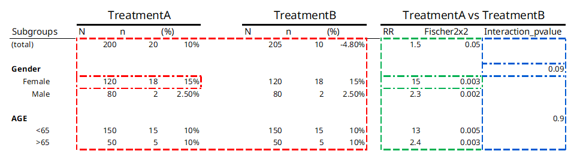

# Function types

    #> 
    #> Attaching package: 'data.table'
    #> The following object is masked from 'package:base':
    #> 
    #>     %notin%

This vignette presupposes basic familiarity with the chef package,
specifically the endpoint specifications and the data_prepare steps

## Statistical method types in chef and chefStats

The chef framework categorizes statistical functions into three main
categories depending on how they operate over stratification levels and
treatment levels. Operations can either be done once per stratification
level or treatment level, or they can operate across levels.

Figure 1 below shows a typical table from a safety analysis and color
codes each result based on the function type that creates it:

Figure 1

  
Table 1 below provides a description of each of the three function
types, color coded to the outputs they produce in table 1 above:

| Name | Description | Example function | Example application |
|:---|:---|:---|:---|
| stat_by_strata_and_trt | For each strata type (e.g. SEX, AGEGR, etc): one output per unique combination of strata level and treatment level | [`n_subj()`](https://hta-pharma.github.io/chefStats/reference/n_subj.md) - Counts number of subjects in each stratification level and treatment level | What is the total number of Females in TreatmentA |
| stat_by_strata_across_trt | For each strata type (e.g. SEX, AGEGR, etc): one output per strata level, across treatment levels | [`RR()`](https://hta-pharma.github.io/chefStats/reference/RR.md) - Calculates the relative risk for the outcome/event within a stratification level | What is the relative risk of having the outcome for females in Treatment A as compared to females in Treatment B |
| stat_across_strata_across_trt | One output per strata type (e.g. SEX, AGEGR, etc), across treatment levels | [`p_val_interaction()`](https://hta-pharma.github.io/chefStats/reference/p_val_interaction.md) - Test of interaction effect for stratification level | Is the risk of having the outcome different across the strata of SEX |

Table 1 {.table .table .table-bordered .table .table-hover
.table-condensed .table-responsive
style="margin-left: auto; margin-right: auto;"}

The function type also determines when the function is applied. In our
example from figure 1, a `stat_by_strata_by_trt` function will be called
once for each combination of stratification level and treatment level,
as well as once for TOTALS for each treatment level:

1.  SEX == “MALE” & TRT == “TreatmentA”
2.  SEX == “FEMALE” & TRT == “TreatmentA”
3.  SEX == “MALE” & TRT == “TreatmentB”
4.  SEX == “FEMALE” & TRT == “TreatmentB”
5.  AGE == “\<65” & TRT == “TreatmentA”
6.  AGE == “\>=65” & TRT == “TreatmentA”
7.  AGE == “\<65” & TRT == “TreatmentB”
8.  AGE == “\>=65” & TRT == “TreatmentB”
9.  TOTAL\_ == “total” & TRT == “TreatmentA”
10. TOTAL\_ == “total” & TRT == “TreatmentB”

Whereas a `stat_across_strata_across_trt` will only be called once per
stratification “group”, i.e.:

1.  strata_var == “SEX”
2.  strata_var == “AGE”
